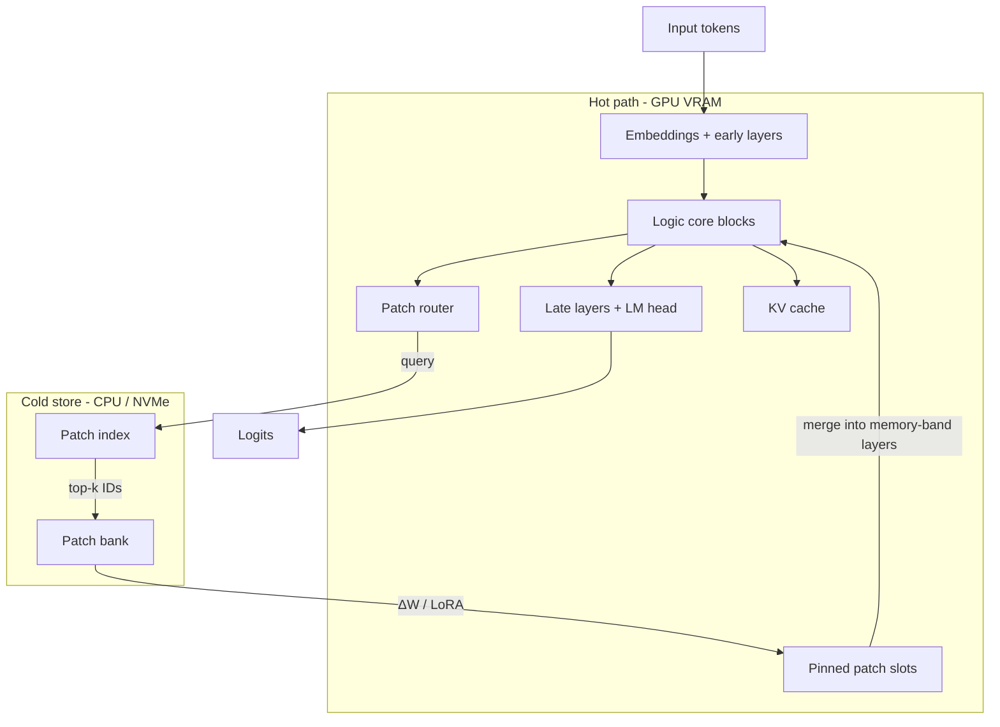

# LCRP architecture (Phase 0)

## Thesis

Dense open-weight models pay full VRAM for parameters that are mostly
*parametric memory*. LCRP splits that into:

1. **Logic core** — small, always resident; syntax, control, routing features,
   general competence.
2. **Patch bank** — cold parametric memory as addressable ΔW / LoRA shards on
   CPU or NVMe.
3. **Router + pin slots** — per segment, retrieve and fuse only what is needed.

Goal: resident set ≪ dense W4/W8 while quality on domain/long-tail tasks stays
within pre-registered deltas of an oracle-patched or dense baseline.

## Diagram

## Components

### Logic core

Dense (or lightly compressed) stack that must remain competent with **patches
disabled**. Owns early layers, a mid-depth “controller” band, late layers, and
the LM head. Target footprint: fit with KV for the intended context on the
target SKU (see illustrative budget below).

### Patch unit (v1)

Prefer **typed deltas**, not arbitrary matrix surgery:

- Default: LoRA / VeRA on MLP (`up` / `gate` / `down`) in a mid-depth memory
  band; optional attn `O` / `V`.
- Rank small (e.g. 8–64). One patch ≈ megabytes, not a full FFN expert.
- Metadata: `id`, layer mask, domain/lang/cluster tags, content digest.

v2 (harder): salient channel / column packs (AWQ-adjacent). Same router,
heavier kernels.

### Router

- **Granularity:** segment (every N tokens, chunk, or tool boundary) — not
  per-token in v1.
- Query from early/mid pooled hidden state → score patch embeddings → top-k
  (2–8).
- Below threshold τ → **core-only** (no pin). That is the easy-path VRAM/latency
  win.
- Soft mix of pinned patches allowed; hard top-k is clearer for research.

### Apply + lifecycle

1. Segment arrives → route → top-k.
2. Prefetch from NVMe into pin cache (LRU / priority).
3. Fuse: `W_eff = W_core + Σ π_i B_i A_i` on memory-band layers.
4. Forward; journal every step.
5. Evict cold pins under pressure; **never** evict the core.

Prefetch one segment ahead so PCIe hides behind compute. If it cannot hide,
the design loses to W4 even when quality is fine.

### Training sketch (required for separability)

You cannot amputate knowledge from a finished dense checkpoint cleanly. Train
for the split:

1. Core pretrain/distill with patches often off.
2. Grow bank: freeze core (mostly); train one patch per cluster/shard.
3. Train router with a “no patch” class; penalize expected pins / bytes moved.
4. Optional knowledge scrub so the core does not re-absorb long-tail facts.

## Illustrative VRAM budget (not a measurement)

| Piece | Example only |
| --- | --- |
| Logic core 3–8B FP8/BF16 | ~6–16 GiB |
| K pinned LoRAs @ ~20 MiB | ~0.3 GiB |
| Patch cache headroom | ~1 GiB |
| KV cache | often dominates at long context |
| Cold bank on NVMe | capacity without GPU residency |

Replace these with **measured** bloomery-style accounting before any claim.

## Falsifiers

Abandon or revise if:

- Router needs k so large that resident set ≈ MoE / dense W4.
- Multi-hop always needs conflicting packs simultaneously.
- Prefetch cannot hide PCIe wait on the target SKU.
- Core-only collapses on “logic” tasks that were actually memorized procedures.
- G-router-cover or G-quality-vs-w4 fails under the eval plan.

## Minimal prototype

1. Freeze a small instruct model as core.
2. Train 50–200 LoRAs on disjoint clusters.
3. Linear (or small) router on pooled layer-L states.
4. Eval arms: core-only / oracle patches / learned router / dense baseline.
5. Trace with the sensorium harness; admit with bloomery accounting.
